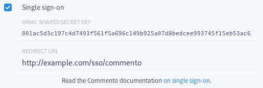

### Commento Single Sign-On

Single sign-on (SSO) is a custom authentication protocol that delegates user management to a different service. For example, if you already support user registration and login, you may want your readers to log in using your service instead of creating yet another account. Commento's SSO lets you do that.

#### Enabling SSO

To enable SSO in Commento, go to the dashboard and tick the corresponding box in your domain's general settings, like so:

<p style="text-align: center"></img></p>

A HMAC shared secret key will be generated and you will be prompted to enter a redirect URL to send your users to. The automatically generated 32-byte hexadecimal HMAC key should be kept secret.

#### Implementing Commento SSO

Integrating Commento's SSO protocol with your website requires some backend work.

Let's say you have Commento embedded in your blog `blog.example.com`. When the user tries to log in with SSO, Commento will redirect users to the redirect URL you set in the dashboard. For the rest of this document, we'll assume this is set to `http://example.com/sso/samlet-chat`. There can only be one redirect endpoint for each domain.

You will receive incoming traffic in the following format:

```
http://example.com/sso/samlet-chat?token=TOKEN&hmac=HMAC
```

`TOKEN` and `HMAC` are hexadecimal representations of size 32 bytes (64 hex characters). We'll denote the shared HMAC secret key by `KEY`.

First, your endpoint must verify that `HMAC` matches the HMAC-SHA256 of the passed `TOKEN` (use `KEY` as the key). Remember to use the 32 decoded bytes in all cases, not the 64-length hex strings.

Following this, your service must authenticate the user. The passed `TOKEN` is valid for ten minutes and will expire once it is used once. This is done to prevent replay attacks.

After the user authentication, you must generate a JSON payload in the following format:

```json
{
  "token": "TOKEN",
  "email": "user@example.com",
  "name":  "User",
  "link":  "http://example.com/profile/user",
  "photo": "http://example.com/photo/user.jpg",
}
```

 - `token` is the token that is sent in the original request. You must include it in the response payload unmodified.
 - `email` is the email address of the user you just authenticated.
 - `name` is the user's name. This will be displayed with the user's comments.
 - `link` is a URL to the user's profile page on your website. Optional.
 - `photo` is a URL that serves a profile picture for the user. Optional.

Using the shared secret key, you must generate the HMAC-SHA256 for the JSON payload described above. Following this, hex-encode the payload and the HMAC; let's call the hex-encoded strings `PAYLOAD` and `HMAC`, respectively. Redirect the user to Commento's SSO callback:

```
http://samlet-chat.valiantlynx.com/api/oauth/sso/callback?payload=PAYLOAD&hmac=HMAC
```

Commento will verify the HMAC-SHA256 to authenticate the callback and log the corresponding user in. A new Commento account will be automatically created if this is the first time the user is logging in this way.

An example pseudo-code implementation of the backend code you need to implement is given below. Some error checking (such as making sure the query parameters aren't empty) are omitted in the interest of brevity.

```lisp
secret-key = hex-decode("001ac5d3c197c4d7493f561f5a696c149b925a07d8bedcee993745f15eb53ac6")

def handle-GET:
  token = query-param("token")
  hmac = hex-decode(query-param("hmac"))

  expected-hmac = hmac-sha256(hex-decode(token), secret-key)
  if hmac != expected-hmac:
    discard and terminate

  email, name, link, photo = authenticate()

  payload-json = {
    "token": token,
    "email": email,
    "name":  name,
    "link":  link,
    "photo": photo,
  }

  hmac = hex-encode(hmac-sha256(payload-json, secret-key))
  payload-hex = hex-encode(payload-json)

  302-redirect("https://samlet-chat.valiantlynx.com/api/oauth/sso/callback?payload=" + payload-hex + "&hmac=" + hmac)
```

#### Security Checklist

Implementing SSO comes with added security responsibility on your end. Here's a checklist of things to consider in order to securly integrate SSO:
1. Your HMAC secret key is kept securely. If you lose this, anybody can impersonate requests from Commento and you will leak personal data.
1. You're verifying signatures before processing data.
1. You're using a well-audited crypto library for HMAC. Never roll out your own crypto.
1. You're using a timing safe comparison algorithm to compare the hashes and not a simple string comparison. This is done to prevent [timing attacks](https://en.wikipedia.org/wiki/Timing_attack).
1. You're authenticating your users properly before sending Commento a response payload. This includes email verification, two-factor authentication, access control lists, and so on.
1. You're redirecting to the HTTPS version of Commento at the end. Personal data is transmitted in this stage and using plain HTTP is grossly insecure.
